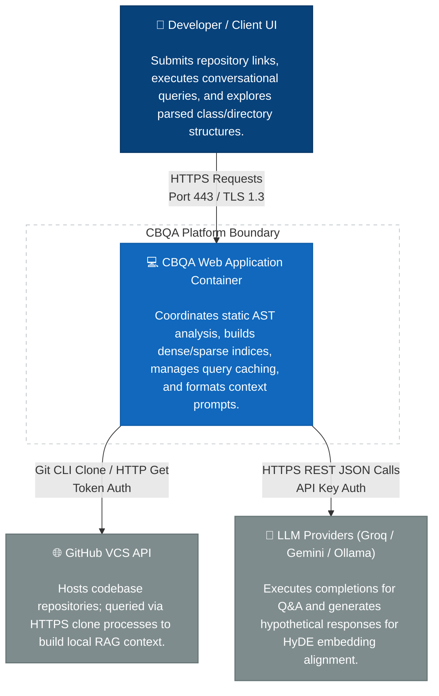
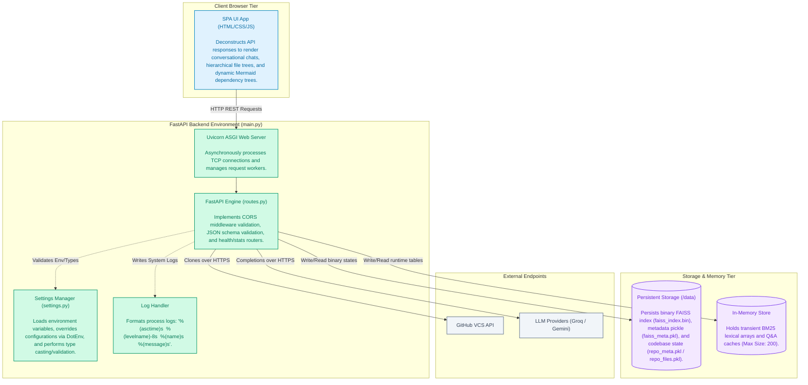
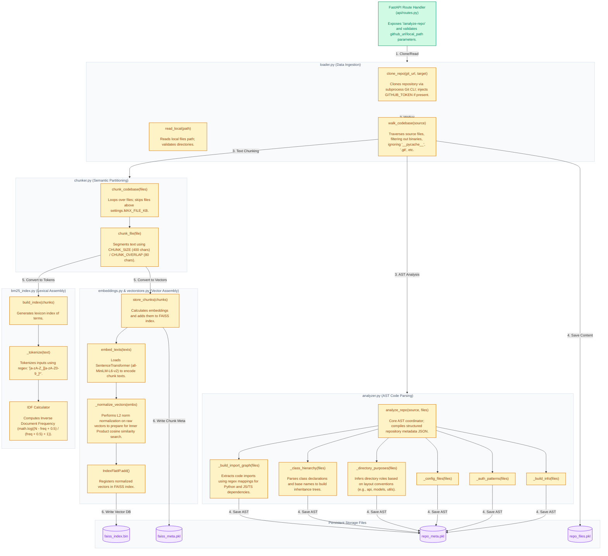
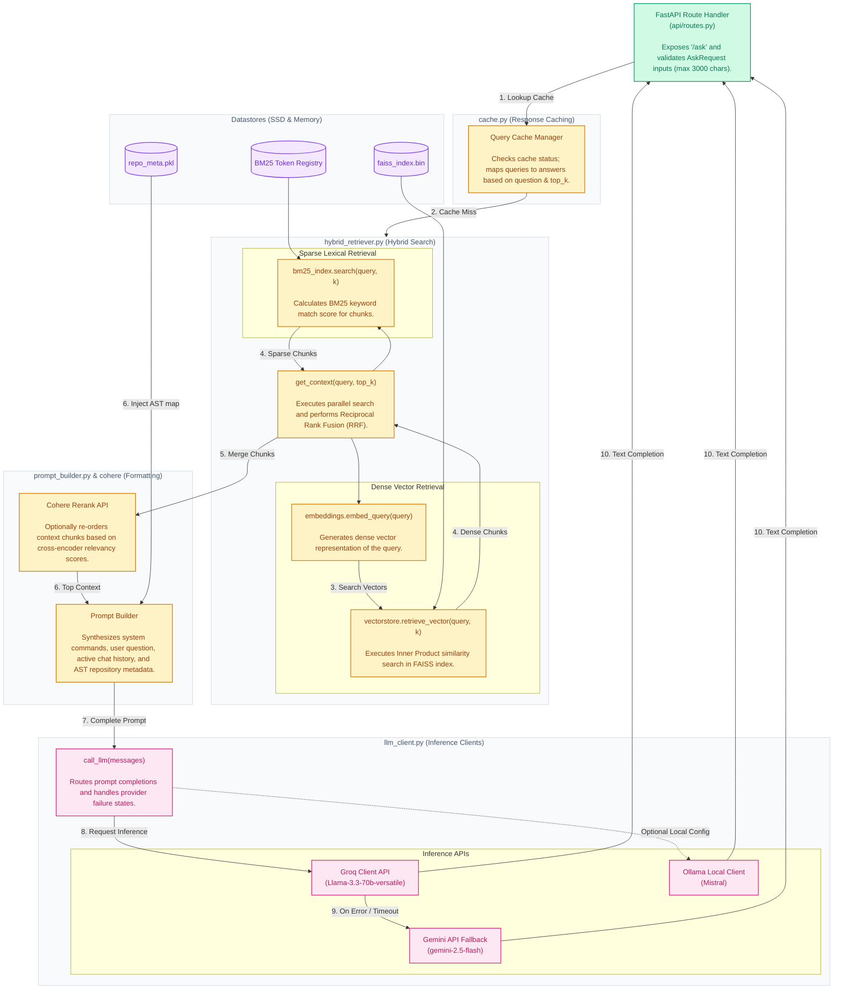

# CBQA Enterprise-Grade Software Architecture Blueprint (Detailed)

This document provides a highly detailed, enterprise-grade software architecture reference for the **CBQA (Codebase Q&A) Platform**. It exposes AST-level components, concrete package boundaries, data transformation steps, error mitigation paths, configuration states, and infrastructure routing protocols.

---

## 1. C4 Level 1: System Context Diagram
Illustrates the user boundaries, system endpoints, TLS encryption layer, and integrations with external version control and LLM services.



---

## 2. C4 Level 2: Container Diagram
Details the running components within the host environment. Exposes the static front-end server, CORS middleware boundaries, configuration parsers, log formatters, caching structures, and local storage formats.



---

## 3. C4 Level 3: Component Diagram (Ingestion & AST Engine)
Deconstructs the write pipeline, showing how files are loaded, analyzed using Abstract Syntax Trees, partitioned into chunk matrices, and converted into dense/sparse indices.



---

## 4. C4 Level 3: Component Diagram (Retrieval & Inference Engine)
Illustrates the read pipeline, cache verification, dense vector searches, lexical keyword scoring, RRF score fusion, Cohere reranking, context assembly, and fallback API completions.



---

## 5. End-to-End Sequence Diagram (Detailed Runtime Execution)
Traces the execution flow of a user query through the system, including validation rules, caching layer lookups, hybrid dense/sparse search, RRF score fusion, prompt compilation, and fallback inference routing.

```mermaid
sequenceDiagram
    autonumber
    actor User as Client UI (Browser)
    participant API as Routes (routes.py)
    participant Cache as QueryCache (cache.py)
    participant Ret as Hybrid Retriever (hybrid_retriever.py)
    participant Embed as Embeddings (embeddings.py)
    participant FAISS as Vector DB (vectorstore.py)
    participant BM25 as Keyword DB (bm25_index.py)
    participant Rerank as Cohere API
    participant Prompt as PromptBuilder (prompt_builder.py)
    participant LLM as LLM Client (llm_client.py)

    User->>API: POST /ask (question, top_k, history)
    
    Note over API: Pydantic Validation: Question length must be < 3000 chars
    
    API->>Cache: query_cache.get(question, top_k)
    
    alt Cache Hit (CACHE_ENABLED = true)
        Cache-->>API: Return cached AskResponse dictionary
        API-->>User: Return HTTP 200 (Cached Response)
    else Cache Miss / Invalidated Cache
        API->>Ret: get_context(question, top_k)
        
        par Dense Vector Retrieval
            Ret->>Embed: embeddings.embed_query(question)
            Embed-->>Ret: Return dense vector array
            Ret->>FAISS: retrieve_vector(dense_vector, top_k)
            Note over FAISS: L2 Norm vector normalization & FAISS Inner Product search
            FAISS-->>Ret: Return top K dense text chunks with cosine similarity score
        and Sparse Keyword Retrieval
            Ret->>BM25: search(question, top_k)
            Note over BM25: Tokenizes query and calculates BM25 term scores
            BM25-->>Ret: Return top K lexical chunks with BM25 score
        end
        
        Ret->>Ret: Merge chunks & calculate Reciprocal Rank Fusion (RRF)
        
        alt USE_RERANK = true & COHERE_API_KEY is configured
            Ret->>Rerank: Rerank combined context chunks
            Rerank-->>Ret: Return re-ordered top context chunks
        end
        
        Ret-->>API: Return final list of context chunks
        
        API->>Prompt: build_prompt(question, context, history, repo_meta)
        Note over Prompt: Injects conversation history (max last 14 messages) & AST structures
        Prompt-->>API: Return system/user structured messages array
        
        API->>LLM: call_llm(messages)
        
        activate LLM
        alt LLM_PROVIDER = "groq"
            LLM->>LLM: Call Groq chat completion API (Llama-3.3-70b)
            alt Groq Success
                LLM-->>API: Return completion text
            else Groq API Fail / Timeout
                Note over LLM: Groq Error Intercepted; triggering failover fallback
                LLM->>LLM: Call Gemini Completion API (Gemini-2.5-Flash)
                LLM-->>API: Return Gemini completion text
            end
        else LLM_PROVIDER = "gemini"
            LLM->>LLM: Call Gemini API (Gemini-2.5-Flash)
            LLM-->>API: Return Gemini completion text
        else LLM_PROVIDER = "local"
            LLM->>LLM: Call Ollama API (Mistral)
            LLM-->>API: Return Ollama completion text
        end
        deactivate LLM
        
        API->>API: Format citations & match line references
        API->>Cache: query_cache.set(question, top_k, response)
        API-->>User: Return HTTP 200 (AskResponse JSON)
    end
```
