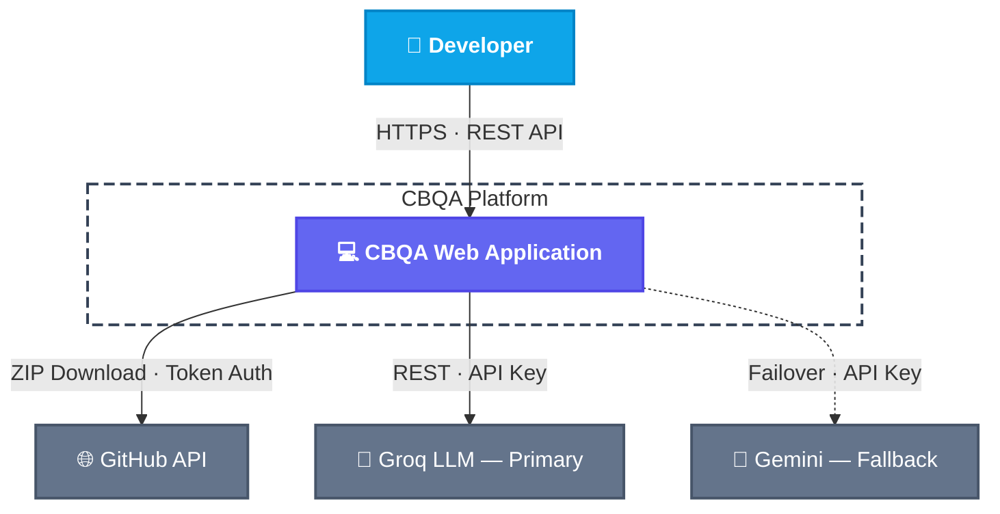
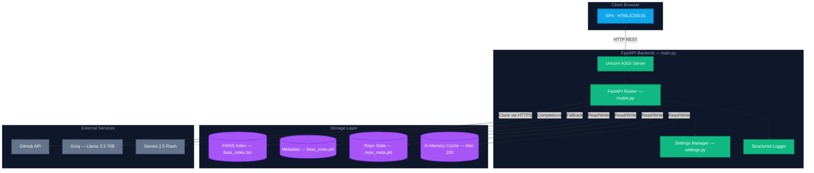
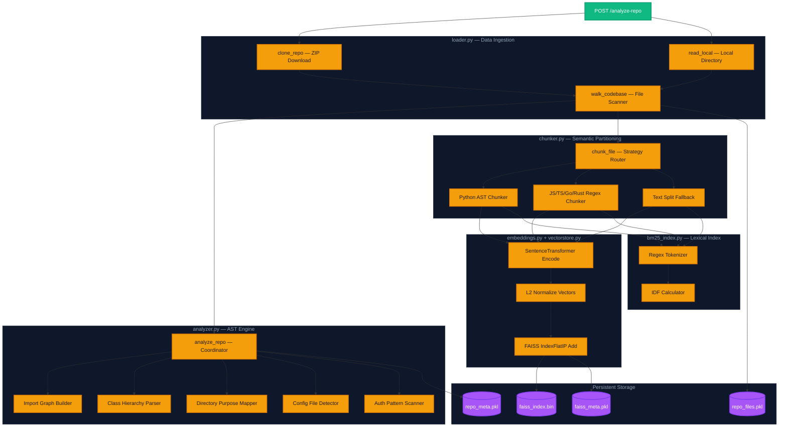
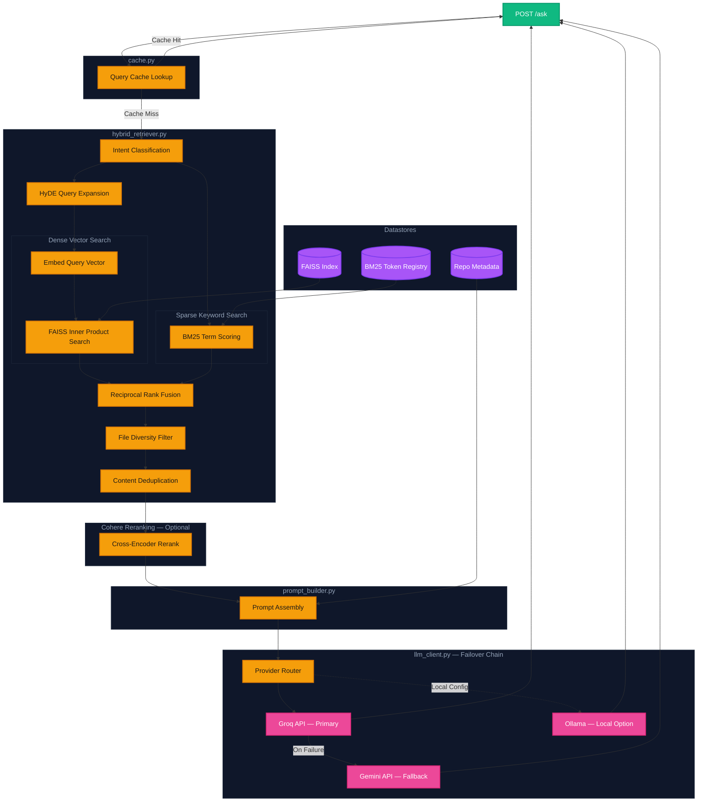
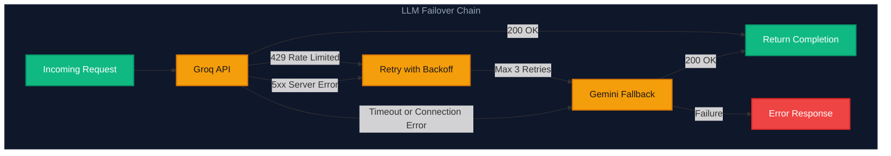

# CBQA V8 — Enterprise Architecture Blueprint

> **AI-Powered Repository Intelligence Platform**
> Primary LLM: Groq (Llama-3.3-70b) · Fallback: Gemini 2.5 Flash · Hybrid RAG: BM25 + FAISS Vector + HyDE + Cohere Rerank

---

## 1. System Context — C4 Level 1

High-level view of users, platform boundaries, and external integrations.



---

## 2. Container Architecture — C4 Level 2

Running components, middleware boundaries, storage layers, and external connections.



---

## 3. Ingestion Pipeline — C4 Level 3

Write path: clone → walk → AST analysis → chunking → embedding → index storage.



---

## 4. Retrieval and Inference Pipeline — C4 Level 3

Read path: cache check → hybrid search → RRF fusion → rerank → prompt → LLM with failover.



---

## 5. End-to-End Query Sequence

Complete runtime trace of a `/ask` request through all system layers.

```mermaid
sequenceDiagram
    autonumber
    actor User as Browser Client
    participant API as Routes — routes.py
    participant Cache as QueryCache — cache.py
    participant Ret as Hybrid Retriever
    participant Embed as Embeddings — SentenceTransformer
    participant FAISS as Vector DB — FAISS
    participant BM25 as Keyword DB — BM25
    participant Rerank as Cohere Rerank API
    participant Prompt as PromptBuilder
    participant LLM as LLM Client

    User->>API: POST /ask with question and history
    Note over API: Pydantic validates question max 3000 chars

    API->>Cache: Lookup by question hash and top_k
    alt Cache Hit
        Cache-->>API: Return cached response
        API-->>User: HTTP 200 — Cached AskResponse
    else Cache Miss
        API->>Ret: get_context with question and top_k

        par Dense Vector Path
            Ret->>Embed: embed_query generates dense vector
            Embed-->>Ret: Return vector array
            Ret->>FAISS: Inner Product similarity search
            FAISS-->>Ret: Top K dense chunks with scores
        and Sparse Keyword Path
            Ret->>BM25: Term frequency scoring
            BM25-->>Ret: Top K lexical chunks with scores
        end

        Note over Ret: RRF merge then diversity then dedup

        alt Cohere Rerank Enabled
            Ret->>Rerank: Re-order by cross-encoder relevance
            Rerank-->>Ret: Reranked top chunks
        end

        Ret-->>API: Final context chunks

        API->>Prompt: Build prompt with context and metadata
        Note over Prompt: Inject history and AST structures
        Prompt-->>API: Structured messages array

        API->>LLM: call_llm with messages

        alt Groq Primary
            LLM->>LLM: POST to Groq REST API
            alt Groq Success
                LLM-->>API: Completion text
            else Groq Failure or Timeout
                Note over LLM: Auto-failover triggered
                LLM->>LLM: POST to Gemini API
                LLM-->>API: Gemini completion text
            end
        else Gemini Direct
            LLM->>LLM: Gemini API call
            LLM-->>API: Completion text
        else Local Ollama
            LLM->>LLM: Ollama local call
            LLM-->>API: Completion text
        end

        API->>Cache: Store response in cache
        API-->>User: HTTP 200 — AskResponse JSON
    end
```



---

## 6. Technology Stack

| Layer | Technology | Purpose |
|-------|-----------|---------|
| **Frontend** | HTML/CSS/JS SPA | Single-page app with Mermaid rendering |
| **Backend** | FastAPI + Uvicorn | Async ASGI web server with CORS |
| **Primary LLM** | Groq — Llama 3.3 70B | Fast inference for Q&A completions |
| **Fallback LLM** | Gemini 2.5 Flash | Auto-failover on Groq failure |
| **Local LLM** | Ollama — Mistral | Optional offline inference |
| **Embeddings** | SentenceTransformer — all-MiniLM-L6-v2 | Dense vector encoding |
| **Vector DB** | FAISS IndexFlatIP | Cosine similarity search |
| **Keyword Search** | Custom BM25 | Exact identifier matching |
| **Reranking** | Cohere Rerank v3 | Optional cross-encoder precision |
| **AST Parsing** | Python ast module + regex | Code-aware chunking |
| **Deployment** | Render.com | Web service with persistent disk |

---

## 7. Directory Structure

```
CBQA3/
├── main.py                    # Application entry point — Uvicorn launcher
├── config/
│   └── settings.py            # Environment config loader with validation
├── backend/
│   ├── api/
│   │   └── routes.py          # FastAPI endpoints and frontend serving
│   ├── analyzer/
│   │   └── analyzer.py        # AST code analysis and repo intelligence
│   ├── ingestion/
│   │   ├── loader.py          # GitHub ZIP download and local file reader
│   │   └── chunker.py         # AST and regex-based semantic chunking
│   └── rag/
│       ├── embeddings.py      # SentenceTransformer model management
│       ├── vectorstore.py     # FAISS index CRUD with persistence
│       ├── bm25_index.py      # BM25 lexical keyword search
│       ├── hybrid_retriever.py # HyDE + RRF fusion + diversity + dedup
│       ├── prompt_builder.py  # Structured prompt assembly with repo context
│       ├── llm_client.py      # Groq primary + Gemini fallback + Ollama
│       ├── cache.py           # LRU query cache with hash-based lookup
│       └── summarizer.py      # Full repo intelligence briefing generator
├── frontend/
│   └── index.html             # Complete SPA with dark theme and Mermaid
├── render.yaml                # Render.com deployment config
├── Procfile                   # Process file for deployment
├── requirements.txt           # Python dependencies
└── ARCHITECTURE.md            # This document
```

---

## 8. Deployment Configuration

```yaml
# render.yaml
services:
  - type: web
    name: cbqa-service
    env: python
    buildCommand: pip install -r requirements.txt
    startCommand: python main.py
    envVars:
      - LLM_PROVIDER: groq          # Primary LLM
      - FAISS_DIR: /data/faiss_db   # Persistent storage path
      # Secrets via Render Dashboard:
      # GROQ_API_KEY, GEMINI_API_KEY, COHERE_API_KEY, GITHUB_TOKEN
    disk:
      name: faiss-data
      mountPath: /data
      sizeGB: 1
```

---

## 9. API Reference

| Method | Endpoint | Description |
|--------|----------|-------------|
| `GET` | `/health` | System health with LLM provider and index stats |
| `GET` | `/stats` | Quick index and cache statistics |
| `POST` | `/analyze-repo` | Ingest a GitHub repo or local directory |
| `POST` | `/ask` | Query the indexed codebase with hybrid RAG |
| `POST` | `/summarize` | Generate full repo intelligence briefing |
| `GET` | `/repo-structure` | Return analyzed repo metadata |
| `GET` | `/file-content?path=...` | Return content of a specific indexed file |
| `DELETE` | `/clear` | Wipe index, cache, and persisted state |
| `GET` | `/` | Serve the frontend SPA |

---

## 10. LLM Failover Strategy



**Retry Policy:**
- Rate limit (429): Wait using `Retry-After` header or exponential backoff (max 30s)
- Server errors (5xx): Linear backoff with 3 max retries
- Timeout: Configurable via `GROQ_TIMEOUT` (default 60s)
- Bad request (400/413): Fail immediately — no retry

---

*CBQA V8 — Production Release · Groq Primary · Gemini Fallback · Hybrid RAG Intelligence*
